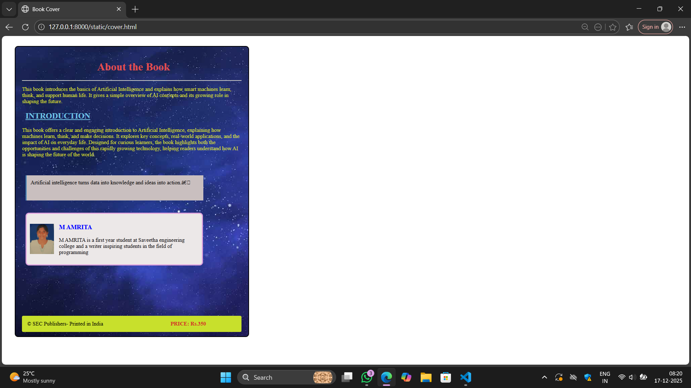

# Ex.05 Book Cover Page Design
## Date:16-12-2025

## AIM:
To design a book back cover page using HTML and CSS.

## DESIGN STEPS:

### Step 1:
Create a Django Admin project.

### Step 2:
Create an app in the Django interface.

### Step 3:
Create a folder named 'static' in the app folder.

### Step 4:
Create a new HTML file in the static folder.

### Step 5:
Write the HTML code with relevant CSS properties.

### Step 6:
Choose the appropriate style and color scheme.

### Step 7:
Insert the images in their appropriate places.

### Step 8:
Publish the website in the LocalHost.

## PROGRAM:
```
cover.html

<html>
    <head>
        <title>Book Cover</title>
        <link href="style.css" rel="stylesheet">
    </head>
    <body>
        
            <div class="cover">
                <h1>About the Book</h1>
        <hr>
        <p>
            This book introduces the basics of Artificial Intelligence and explains how smart machines learn, think, and support human life. It gives a simple overview of AI concepts and its growing role in shaping the future.
        </p>
        <h2><u>INTRODUCTION</u></h2>
        <p>
           This book offers a clear and engaging introduction to Artificial Intelligence, explaining how machines learn, think, and make decisions. It explores key concepts, real-world applications, and the impact of AI on everyday life. Designed for curious learners, the book highlights both the opportunities and challenges of this rapidly growing technology, helping readers understand how AI is shaping the future of the world.
        </p>
        <br>
        <br>
        <div class="container">
            Artificial intelligence turns data into knowledge and ideas into action.”
        </div>
        <br>
        <br>
    
        <div class="box">
            
             <div class="item">  
                <h3>M AMRITA</h3>
                <p>M AMRITA is a first year student at Saveetha engineering college and a writer inspiring students in the field of programming</p>
            </div>
        </div>
         <div class="footer">
            <span>&copy SEC Publishers- Printed in India</span>
            
            <b>
             <div class="price">  
             <span>PRICE: Rs.350</span>
            </div>
            </b>
            </div>
    </body>
</html>

style.css

.cover
{
    background-image: url('img.jpg');
    height:820px;
     width:650px;
     margin: 30px;
     padding:20px;
     border-radius: 10px;
     border:3px solid;
}

h1
{
    color: rgb(227, 78, 78);
    text-align: center;
    margin-left: 10px;
}

h2
{
    color: rgb(112, 192, 227);
    margin-left: 10px;
}

.item p
{
    color: rgb(11, 9, 11);
    margin-left: 0px;
}

.container
{
    width: 500;
    height:50;
    background-color: rgb(201, 191, 191);
    border-left: 4px solid steelblue;
    padding: 12px;
    margin-left: 10px;
}
.box
{
    
    width: 500;
    margin-left: 10px;
    background:rgb(236, 232, 232);   
    border:4px solid plum;         
    padding: 10px;
    border-radius: 10px;          
    display: flex; 
    flex-direction: row;               
    align-items: center;          
    gap: 15px;                   
     
}

.footer
{
    
    background-color: rgb(200, 224, 44);
    margin-top: 150px;
    display: flex;
    padding: 15px;
    border-radius: 4px;
    flex-direction: row;
    gap: 200px;
    
}

.price
{
    color: rgb(211, 38, 38);
    margin-left: 0px;
}

h3
{
    color:blue;
}

div p
{
    color:rgb(221, 224, 40);
    margin-left: 0;
}
span
{
    margin: left 20px;;
}
```

## OUTPUT:


## RESULT:
The program for designing book back cover page using HTML and CSS is completed successfully.
